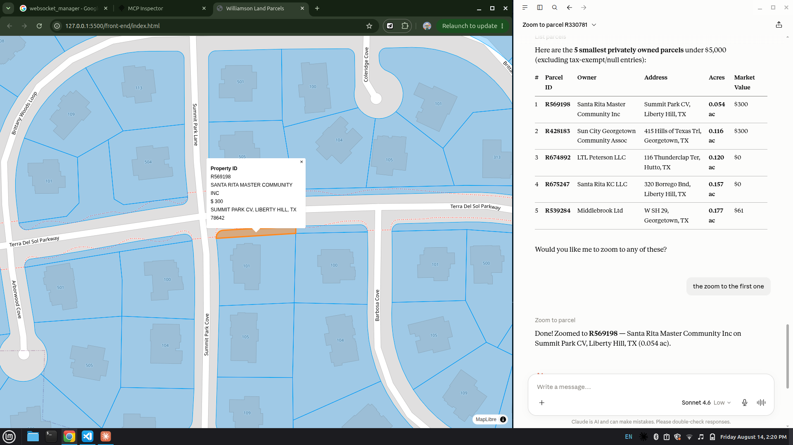

# Parcel AI MCP

Welcome, this is me learning how to empowered Modern GIS With AI Capabilities. Imagine just prompting which parcels with define area and market value then 

## Techstack

1. UV python
2. Postgres/PostGIS
3. SQL Alchemy
4. MCP SDK python
5. LLM AI Claude
6. FastAPI
7. WebSockets
8. HTML, CSS, JS (front end)

## More

getting started - [link](docs/installation.md)
for archtecture - [link](docs/architecture.md)
extra gis tile optimization in postgres - [link](docs/gis.md)
